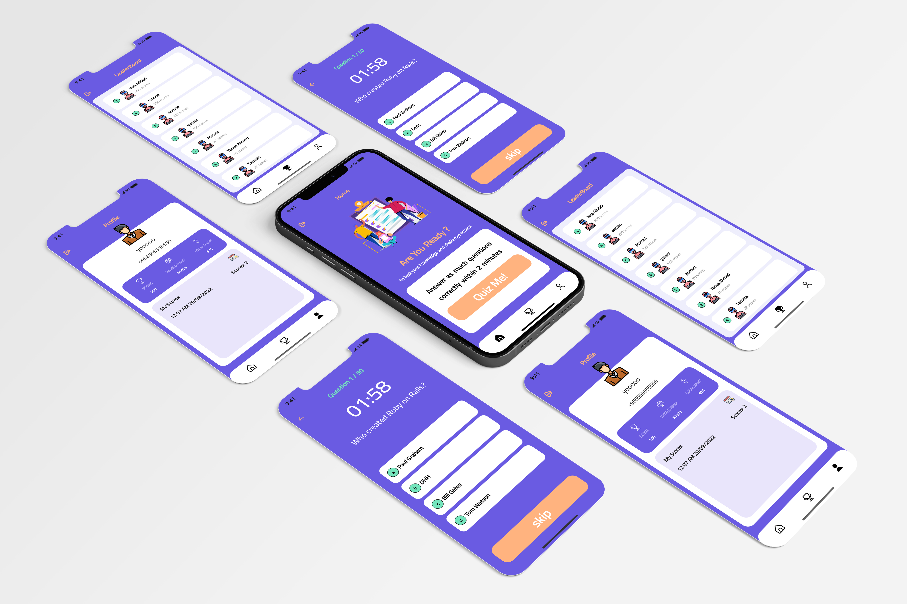

    

# Quiz U App :

In this project, I developed an application using the Dart language (Flutter), a simple app that displays many questions and the user has to answer in 2 minutes only.

# dependencies :
  dio: ^4.0.6
  pinput: ^2.2.12
  loading_indicator: ^3.1.0
  shared_preferences: ^2.0.15
  flutter_svg: ^1.1.5
  get: ^4.6.5
  intl_phone_number_input: ^0.7.1
  persian_number_utility: ^1.1.2
  share_plus: ^4.4.0
  intl: ^0.17.0

